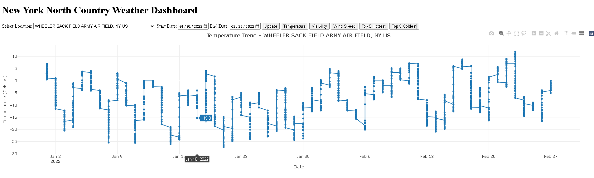
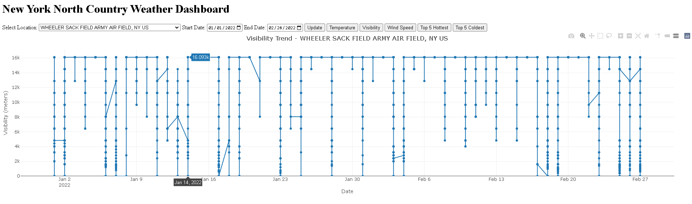
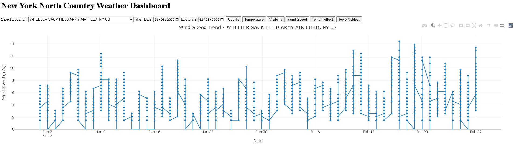
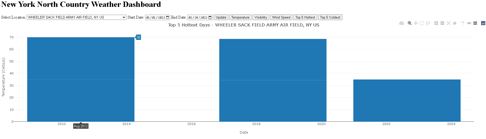

# New York North Country Weather Dashboard

A web-based data analytics platform built using Flask, DuckDB, and Plotly to provide interactive visualization and statistical analysis of historical weather data for New York North Country Dashboard.  
This project demonstrates an end-to-end ETL (Extract, Transform, Load) pipeline optimized for filtering, transforming, and analyzing over one million weather observations.

---

## Table of Contents

1. [Project Overview](#project-overview)  
2. [Data Gathering](#data-gathering)  
3. [Data Cleaning and ETL Process](#data-cleaning-and-etl-process)  
4. [Database Overview](#database-overview)  
5. [Flask Application and API Routes](#flask-application-and-api-routes)  
6. [Dashboard Overview](#dashboard-overview)  
7. [Runtime Performance](#runtime-performance)  
8. [How to Run](#how-to-run)  
9. [Technologies Used](#technologies-used)  
10. [License](#license)  
11. [Authorship and Acknowledgements](#authorship-and-acknowledgements)

---

## Project Overview

This application delivers an interactive suite of weather visualizations for Potsdam, NY.  
Starting from a large global weather dataset, we isolated USA records and extracted high-quality time series data specifically for the Potsdam region.

The data is stored in a local DuckDB analytical database for efficient querying, while the frontend, built with Flask and Plotly, allows users to explore trends in temperature, visibility, wind speed, and extreme weather events.

---

## Data Gathering

- **Source:** Global historical weather archives (NOAA and related agencies).
- **Initial Dataset:** Multiyear, worldwide records including millions of observations.
- **Filtering Steps:**
  - Retained only USA stations.
  - Extracted records where station latitude and longitude matched proximity to Potsdam, NY.

| Station ID     | Latitude     | Longitude    |
|----------------|--------------|--------------|
| 72518699999    | 44.681854     | -75.465500   |
| 72622394725    | 44.933410     | -74.848360   |
| 72622894740    | 44.392790     | -74.202880   |
| 74370014715    | 44.050000     | -75.733330   |
| 99822399999    | 44.333333     | -75.933333   |
| 99843599999    | 44.703000     | -75.495000   |

---

## Data Cleaning and ETL Process

Data preparation and transformation were handled in the `Data.ipynb`, `ETL.ipynb`, and `potsdam.ipynb` notebooks.

### Cleaning and Transformation Steps:

| Step                    | Description |
|--------------------------|-------------|
| **Null and Sentinel Handling** | Replaced invalid measurements (e.g., `9999`, `999.9`) with NULLs, dropped records where critical fields (e.g., temperature) were missing. |
| **Outlier Removal**       | Filtered erroneous values for visibility, wind speed, and temperature. |
| **Date Parsing**          | Standardized dates to DuckDB DATE type for better querying and slicing. |
| **Geographic Filtering**  | Selected stations based on latitude and longitude matching Potsdam's vicinity. |
| **Wind Speed Extraction** | Parsed compound fields (e.g., `WND`) to extract actual wind speeds in m/s. |
| **Schema Normalization**  | Harmonized column names, types, and units across different data years. |
| **Database Storage**      | Loaded cleaned data into DuckDB for optimized SQL querying and dashboard use. |

### Format Conversion:
- All raw CSVs were cleaned and stored as a structured DuckDB table: `combined_cleaned`.

---

## Database Overview

**Final database file:** `weather.duckdb`  
**Main table:** `combined_cleaned`

### Table Schema

| Column Name    | Data Type  | Description                         |
|----------------|------------|-------------------------------------|
| DATE           | DATE       | Observation date                   |
| NAME           | VARCHAR    | Station name / location            |
| TEMP_C         | DOUBLE     | Temperature in Celsius             |
| VIS_M          | DOUBLE     | Visibility in meters               |
| WND            | VARCHAR    | Wind metadata (parsed for speed)   |
| LAT            | DOUBLE     | Latitude                           |
| LON            | DOUBLE     | Longitude                          |

- The `combined_cleaned` table contains ~1 million clean observations.
- All missing or invalid fields have been documented and handled.

---

## Flask Application and API Routes

The `app.py` file defines an interactive Flask web server with multiple RESTful endpoints serving JSON-capable data.

| Route                | Description                        |
|----------------------|------------------------------------|
| `/`                  | Home dashboard (HTML with Plotly)   |
| `/data`              | Temperature trend data             |
| `/data_visibility`   | Visibility trend data              |
| `/data_wind`         | Wind speed trend data              |
| `/data_top5_hot`     | Top 5 hottest days                 |
| `/data_top5_cold`    | Top 5 coldest days                 |

Each API responds with a structured JSON object containing:
```json
{
  "dates": ["YYYY-MM-DD", ...],
  "values": [float, float, ...],
  "title": "Plot Title",
  "xaxis": "Date",
  "yaxis": "Variable Name"
}
```
All responses are dynamically generated by querying the `combined_cleaned` table inside `weather.duckdb`.

---

## Dashboard Overview

The front-end UI uses **Plotly.js** to display dynamic, interactive visualizations based on user-selected parameters.

### Available Graphs:
- **Temperature Trend** over user-specified date ranges
- **Visibility Trend** (meters) timeline
- **Wind Speed Trend** (m/s) timeline
- **Top 5 Hottest Days** (bar chart)
- **Top 5 Coldest Days** (bar chart)

### Example Screenshots:

| Visualization             | Preview                          |
|----------------------------|----------------------------------|
| Temperature Timeline       |  |
| Visibility Timeline        |    |
| Wind Speed Timeline        |          |
| Top 5 Hottest/Coldest Days  |        |

---

## Runtime Performance

DuckDB provides superior in-memory analytics performance:

| Operation                  | Performance Benchmark            |
|-----------------------------|-----------------------------------|
| Raw CSV loading             | < 1 second per 1 GB (multithreaded) |
| SQL aggregation queries     | ~10-50 ms response time            |
| API response latency        | < 200 ms for Potsdam queries       |

- Benchmark system: 32-core CPU, 96 GB RAM.
- DuckDB's columnar storage and vectorized execution ensure that dashboard interactivity is near-instantaneous.

---

## How to Run

1. Clone the repository:
```bash
git@github.com:Clarkson-Applied-Data-Science/2025_ia626_juttua.git
cd 2025_ia626_juttua
```

2. Install dependencies:
```bash
pip install flask duckdb
```

3. Verify the `weather.duckdb` file exists. If not, run the Jupyter notebooks to generate it:
```bash
jupyter notebook Data.ipynb
jupyter notebook ETL.ipynb
jupyter notebook potsdam.ipynb
```

4. Start the Flask server:
```bash
python app.py
```

5. Access the dashboard in your browser:
```
http://127.0.0.1:5000/
```

---

## Technologies Used

- **Python 3.10+**
- **DuckDB** for high-speed analytical queries
- **Flask** for backend web application
- **Plotly.js** for client-side visualizations
- **HTML + Jinja2** templating engine
- **Jupyter Notebooks** for ETL pipeline

---

## License

This project is licensed under the MIT License.  
See the `LICENSE` file for full licensing information.

---

## Authorship and Acknowledgements

Developed by [Ashish Varma Juttu].  
Special thanks to NOAA for providing the original global weather datasets.  
Appreciation is extended to the developers of DuckDB, Flask, and Plotly for their outstanding open-source contributions.  
This work is released for academic and non-commercial purposes.

